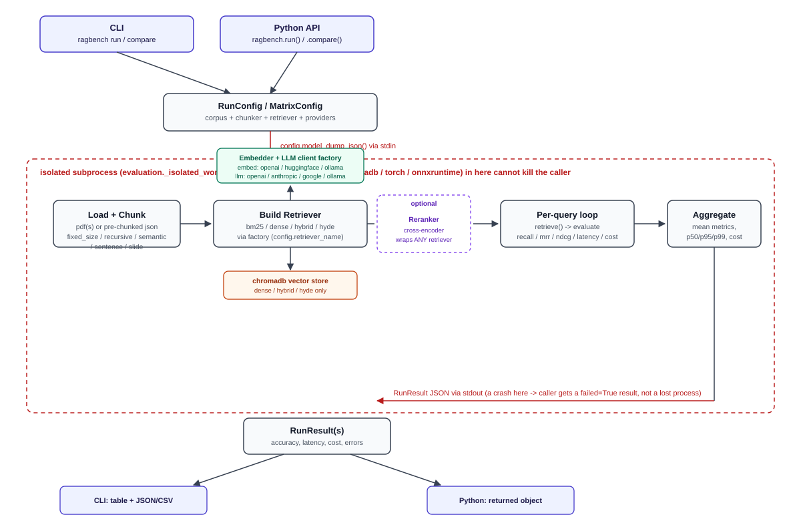

# Ragbench

Benchmark chunking and retrieval strategies on your own data: compare **accuracy**, **latency**, and **cost** across every chunker × retriever combination, against real or LLM-generated questions.

**CLI command:ragbench compare --config examples\scifact_all.json**


---

## ⚠️ Before you install

**Use a venv built from a standard Python (python.org, or your OS's `python3`)  not one whose base interpreter is Anaconda or Miniconda.**

`ragbench` depends on packages with native/compiled components (`chromadb`, `torch` via the optional `huggingface`/`rerank` extras, `onnxruntime`). On an Anaconda-based Python these can fail to import, or crash outright including hard segfaults during `chromadb` operations, because of how Anaconda bundles its own native libraries alongside them. Symptoms look like `ImportError: DLL load failed` or the process just dying with no traceback, no matter what package versions you install.

If you only have Anaconda installed: install Python from [python.org](https://www.python.org/) first, then create your venv from *that* interpreter specifically (`path\to\pythoncore\python.exe -m venv .venv`, not the `conda`/Anaconda one).

---

## Install

```bash
pip install ragbench
```

Optional extras:

| Extra | Adds | Why it's optional |
|---|---|---|
| `huggingface` | `sentence-transformers`, `transformers` | Local/free embeddings heavy (`torch`), so opt-in |
| `rerank` | `sentence-transformers` | Cross-encoder reranking same `torch` dependency |
| `yaml` | `pyyaml` | Lets config files be `.yaml`/`.yml`, not just `.json` |
| `mlflow` | `mlflow` | Optional tracing on LLM calls, no-ops cleanly if unset |
| `dev` | `pytest`, `pytest-cov` | Only needed if you're developing `ragbench` itself |
| `all` | every extra above | |

```bash
pip install "ragbench[huggingface,rerank]"
```

`openai`, `anthropic`, `google-genai`, and `chromadb` are **core** dependencies (not extras), every retriever except `bm25` needs a vector store, and the point of the tool is comparing providers, so gating them behind extras would defeat the purpose.

---

## Quick start — CLI

```bash
ragbench run --config run.json
ragbench compare --config matrix.json --sort-by recall_at_k --save-json out.json --save-csv out.csv
ragbench detail --config run.json --chunker recursive --retriever hyde
ragbench list-chunkers
ragbench list-retrievers
```

A minimal `run.json` (single chunker × retriever):

```json
{
  "corpus_path": "chunks.json",
  "benchmark_queries_path": "questions.json",
  "benchmark_qrels_path": "qrels.json",
  "chunker_name": "recursive",
  "retriever_name": "hyde",
  "llm_provider": "openai",
  "llm_model": "gpt-4.1-mini"
}
```

A `matrix.json` (sweeps every combination) uses `chunker_names`/`retriever_names` (plural, lists) instead of `chunker_name`/`retriever_name`:

```json
{
  "corpus_path": "chunks.json",
  "benchmark_queries_path": "questions.json",
  "benchmark_qrels_path": "qrels.json",
  "chunker_names": ["recursive", "fixed_size"],
  "retriever_names": ["bm25", "dense", "hybrid", "hyde"]
}
```

> ⚠️ These two shapes are easy to mix up, pointing `ragbench compare` at a singular-field config (or `ragbench run` at a plural one) fails with a clear pydantic "Field required" error, not a silent misconfiguration. If you see that error, check you're using the right shape for the command.

---

## Quick start — Python (no terminal required)

```python
import ragbench  # auto-loads a .env file for API keys, if one exists next to your script

result = ragbench.run(
    corpus_path="chunks.json",
    benchmark_queries_path="questions.json",
    benchmark_qrels_path="qrels.json",
    chunker_name="recursive",
    retriever_name="hyde",
    llm_provider="openai",
    llm_model="gpt-4.1-mini",
)
print(result.accuracy, result.cost)

results = ragbench.compare(
    corpus_path="chunks.json",
    benchmark_queries_path="questions.json",
    benchmark_qrels_path="qrels.json",
    chunker_names=["recursive", "fixed_size"],
    retriever_names=["bm25", "dense", "hyde"],
)
for r in results:
    print(r.chunker_name, r.retriever_name, r.accuracy.get("recall_at_k"))
```

### API keys

Put them in a `.env` file next to your script:

```
OPENAI_API_KEY=sk-...
ANTHROPIC_API_KEY=sk-ant-...
GOOGLE_API_KEY=...
```

`import ragbench` loads it automatically — no manual `export`/`set` needed, and it works identically whether you use the CLI or the Python API. Prefer to manage keys yourself instead (multiple accounts, a secrets manager)? Both `ragbench.run()` and `ragbench.compare()` accept an explicit override:

```python
result = ragbench.run(..., api_key="sk-ant-...")               # applies to both LLM + embedding calls
result = ragbench.run(..., llm_api_key="sk-ant-...",            # or set them independently, if the
                            embedding_api_key="sk-...")          # LLM and embedder use different providers
```


---

## What it measures

For every chunker × retriever combination, one `RunResult` with:

- **accuracy** — `recall_at_k`, `precision_at_k`, `hit_at_k`, `hit_rate_at_k`, `mrr`, `ndcg_at_k`
- **latency** — `mean`, `p50`, `p95`, `p99`, `min`, `max` (milliseconds, per query)
- **cost** — `total_cost`, `cost_per_query`, `cost_per_1k_tokens`, `total_tokens` (USD; `$0`/untracked for free or unrecognized models — see [Cost tracking](#cost-tracking-caveats) below)
- **errors** — per-query error messages that didn't fail the whole run
- **failed** / **error_message** — set if the whole combination couldn't run at all (bad config, index build failure, crash)

> 📸 **Add a screenshot here:** `ragbench detail --config run.json --chunker recursive --retriever hyde` output, showing the full per-combination metric breakdown.

---

## System design



Both entry points (CLI and Python API) build the same `RunConfig`/`MatrixConfig`, which is handed to a subprocess (`evaluation._isolated_worker`) as JSON over stdin. That subprocess boundary exists specifically because a segfault in a native dependency (`chromadb`, `torch`, `onnxruntime`) cannot be caught by Python's `try`/`except` — the OS kills the process before any exception machinery runs. Isolating each chunker × retriever combination in its own subprocess means one bad combination becomes an ordinary `failed=True` result instead of losing an entire matrix sweep.

Inside the subprocess: the corpus is loaded and chunked, the embedder and LLM client are resolved through a provider factory (so retrievers never import a concrete provider directly), the retriever runs its per-query loop, and metrics are aggregated into a `RunResult` that's written back to the parent over stdout.


---

## Chunkers

| Name | Strategy |
|---|---|
| `fixed_size` | Fixed word-count windows with overlap |
| `recursive` | Recursively splits on paragraph → line → sentence → word boundaries until each piece fits `max_size` |
| `semantic` | Groups sentences by embedding similarity (needs an embedder — defaults to OpenAI if none given) |
| `sentence` | One (or a few) sentences per chunk |
| `slide` | Sliding window over sentences/units |

`chunker_params` in your config passes strategy-specific kwargs straight to the chunker's constructor (e.g. `{"max_size": 150}` for `recursive`).

Corpus input can be:
- a **pre-chunked** `.json`/`.jsonl` file (each record needs at least `text` + `chunk_id`/`doc_name` — field aliases like `content`/`body`/`id`/`document` are normalized automatically), which **skips chunking entirely** regardless of what `chunker_name` you set, or
- a **single PDF** (`corpus_path` pointing at one `.pdf` file), or
- a **directory of PDFs** (`corpus_path` pointing at a folder) — every `.pdf` in it is chunked with the same strategy and the results combined, with chunk IDs re-sequenced globally.

> ⚠️ If you're testing `chunker_name` itself, make sure `corpus_path` is a PDF (or PDF directory), not pre-chunked JSON — JSON input bypasses the chunker entirely, so `chunker_name` has no effect on it.

---

## Retrievers

| Name | Needs an embedder? | Needs an LLM? | Notes |
|---|---|---|---|
| `bm25` | No | No | Classic sparse lexical retrieval, self-contained (no external index) |
| `dense` | Yes | No | Embedding similarity via `chromadb` |
| `hybrid` | Yes | No | Combines `bm25` + `dense` |
| `hyde` | Yes | Yes | Generates a hypothetical answer with the LLM first, then embeds *that* for retrieval |

> **Note:** an earlier `self_rag` retriever (self-reflective grading + retry + answer generation) was removed — it was correct but inherently slow (up to 4 LLM calls per query), which made it impractical for routine comparison runs.

---

## Providers

| | LLM (`llm_provider`) | Embeddings (`embedding_provider`) |
|---|---|---|
| **OpenAI** | ✅ `openai` | ✅ `openai` |
| **Anthropic** | ✅ `anthropic` | — (no embeddings API) |
| **Google** | ✅ `google` | — (not wired; Gemini's embedding API isn't implemented here) |
| **Ollama** (local, free) | ✅ `ollama` | ✅ `ollama` |
| **Hugging Face** (local, free) | — | ✅ `huggingface` (needs the `huggingface` extra) |
| **Cohere** | 🚧 listed as valid, raises `NotImplementedError` | 🚧 same |
| **Voyage** | — | 🚧 listed as valid, raises `NotImplementedError` |

Any **OpenAI-compatible endpoint** (OpenRouter, Groq, LM Studio, vLLM, Ollama's own OpenAI-compat API) also works through `llm_provider: "openai"` by setting `OPENAI_BASE_URL` — e.g. OpenRouter for testing Claude/Gemini without a direct Anthropic/Google account:

```bash
export OPENAI_API_KEY=sk-or-v1-...
export OPENAI_BASE_URL=https://openrouter.ai/api/v1
```
```json
{ "llm_provider": "openai", "llm_model": "anthropic/claude-3.5-sonnet" }
```

> ⚠️ **Free-tier models are volatile.** Model IDs get deprecated for new accounts, rate-limited, or renamed without much notice (this happened mid-development with a Gemini model). If a request 404s or connection-errors unexpectedly, check the provider's live model list before assuming it's a `ragbench` bug — for OpenRouter: `GET https://openrouter.ai/api/v1/models`; for Google: `client.models.list()`.

> ⚠️ **Anthropic has no true no-card free tier** — API access requires billing set up on the account (occasionally with a small free credit grant for new accounts). Google's Gemini API, by contrast, has a genuinely free tier via [Google AI Studio](https://aistudio.google.com) with no card required.

---

## Cost tracking caveats

`metrics/cost.py` has a static price table keyed by **exact model-ID string**. This means:

- Local/free providers (`ollama`, `huggingface`) always report `$0`/untracked — correct, no API is billed.
- **Routed model IDs** (OpenRouter's `vendor/model` style, e.g. `anthropic/claude-3.5-sonnet` used via `provider: "openai"`) are **not recognized** by the price table, so cost shows as `$0`/untracked even though OpenRouter is actually billing you. Check OpenRouter's own dashboard for real spend when using it this way.
- A model released after this package's price table was last updated will also show as untracked until the table is updated with its pricing.

---

## Reranking

Any retriever can be wrapped with a cross-encoder reranker — it composes with all of `bm25`/`dense`/`hybrid`/`hyde` without any of them knowing reranking exists:

```json
{
  "...": "...",
  "use_reranker": true,
  "reranker_model": "cross-encoder/ms-marco-MiniLM-L6-v2",
  "rerank_candidate_k": null
}
```

`rerank_candidate_k` defaults to `top_k * 4` when `null` — the retriever over-fetches that many candidates, then reranks down to `top_k`. Needs the `rerank` extra (`sentence-transformers`).

---

## Synthetic benchmarks (no labeled data required)

Omit `benchmark_queries_path`/`benchmark_qrels_path` entirely and `ragbench` generates questions itself using the configured LLM, sampling representative chunks from your corpus:

```json
{
  "corpus_path": "my_documents/",
  "chunker_names": ["recursive"],
  "retriever_names": ["bm25", "dense"],
  "llm_provider": "openai"
}
```

> ⚠️ Synthetic question quality is entirely dependent on the generating LLM — there's no ground truth, so treat synthetic-benchmark accuracy numbers as directional (useful for A/B'ing chunkers/retrievers against each other), not as an absolute accuracy claim.

---

## Development status

- **No automated test suite yet** (`pytest`/`pytest-cov` are in the `dev` extra, but `tests/` is currently just a placeholder package). Everything in this package has been exercised through real, manual benchmark runs against real provider APIs rather than unit tests — solid for correctness-in-practice, but there's no CI regression safety net yet. Worth adding before accepting outside contributions.
- Crash isolation (subprocess-per-combination) has been verified against a real forced segfault, not just reasoned about.

> 📸 **Optional — add a screenshot here** of a passing test run, once a test suite exists.

---

## License

MIT — see [LICENSE](LICENSE).
